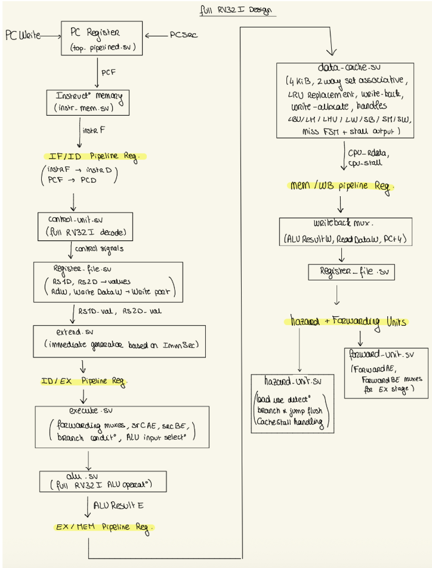

## Team members:
Sumukh Adiraju - CID: 02563601
Ambre Carrier - CID: 
Lea Acanal - CID: 
Deniz Yilmazkaya - CID:


# Table of contents:

- [Overview](#overview)
- [Repo Structure](#repo-structure)
    - [Single Cycle RV32I Implementation](#single-cycle-rv32i-implementation)
    - [Stretch goal 1: Pipelined RV32I Implementation](#stretch-goal-1-pipelined-rv32i-implementation)
    - [Stretch goal 2: Memory Cached Pipelined RV32I](#stretch-goal-2-memory-cached-pipelined-rv32i)
    - [Stretch goal 3: Full Instruction Set](#stretch-goal-3-full-instruction-set)
    - [Our design decision:](#our-design-decision)
- [Running](#running)
    - [single cycle](#single-cycle)
    - [pipelined](#pipelined)
    


# Overview
This repository contains our team’s complete implementation of an RV32I processor, developed progressively across several milestones and maintained across multiple branches for clarity and traceability. The project began with a fully working single-cycle CPU that implemented the core RV32I instruction subset. Building on this foundation, we extended the design into a five-stage pipelined processor that supported complete forwarding and hazard-detection logic, enabling correct resolution of data hazards, load–use dependencies, and control-flow changes due to branches and jumps. The final stage of development introduced a realistic 4 KiB, two-way set-associative write-back data cache, bringing the design closer to modern processor memory hierarchies by supporting tag checks across both ways, dirty and valid tracking, LRU replacement, and multi-cycle miss handling integrated with the pipeline’s stall signals.


# Repo Structure
Our repository is organised into multiple branches that each correspond to one major stage of the project: the single-cycle processor, the pipelined implementation of it, then cached pipelined, and finally the full RV32I instruction-complete implementation. 
We also worked on our individual branches to not disrupt the whole project we were working on. Once one person completed their section and the team was happy with their implementation, we created PRs and merged with main. 

For easy testing, we created new branches with the final commit of a specific section in it. For example, in the "Single-Cycle-RV32I-Implementation", we placed the final commit that had the fully implemented single cycle CPU (without the pipelining/cache).

## Single Cycle RV32I Implementation

The branch "Single-Cycle-RV32I-Implementation" contains our initial single-cycle RV32I CPU implementing the basic subset of instructions required

Directory structure:
```
 rtl/
├── alu.sv
├── control_unit.sv
├── data_mem.sv
├── datapath.sv
├── extend.sv
├── instr_mem.sv
├── pc_reg.sv
├── register_file.sv
└── top.sv
```

## Stretch goal 1: Pipelined RV32I Implementation

The branch "Pipelined-RV32I-Implementation" introduces our full 5-stage pipeline (IF → ID → EX → MEM → WB), hazard detection, forwarding, and pipeline registers. It still uses the basic instruction subset and a direct memory module without caching.

Directory structure:
```
rtl/
├── pipelined/
│   ├── datapath_pipelined.sv   (if present)
│   ├── exe_mem_reg.sv
│   ├── execute.sv
│   ├── forward_unit.sv
│   ├── hazard_unit.sv
│   ├── id_ex_reg.sv
│   ├── if_id_reg.sv
│   ├── mem_wb_reg.sv
│   ├── pc_reg_pipe.sv
│   ├── tb_execute.sv
│   └── top_pipelined.sv
├── shared/
│   ├── alu.sv
│   ├── control_unit.sv
│   ├── data_mem.sv
│   ├── extend.sv
│   ├── instr_mem.sv
│   ├── pc_reg.sv
│   └── register_file.sv
└── single_cycle/
    ├── datapath.sv
    └── top.sv
```
In this branch we added:
- Pipeline registers
- Hazard unit 
- Forwarding logic 
- Correct multicycle control propagation


## Stretch goal 2: Memory Cached Pipelined RV32I

For this branch "Memory-Cached-Pipelined-RV32I", we kept the 5-stage pipeline from the previous milestone and added a real cache subsystem to replace the simple data memory.

Directory structure:
```
rtl/
├── pipelined/
│   ├── exe_mem_reg.sv
│   ├── execute.sv
│   ├── forward_unit.sv
│   ├── hazard_unit.sv
│   ├── id_ex_reg.sv
│   ├── if_id_reg.sv
│   ├── mem_wb_reg.sv
│   ├── pc_reg_pipe.sv
│   ├── tb_execute.sv
│   └── top_pipelined.sv
├── shared/
│   ├── alu.sv
│   ├── control_unit.sv
│   ├── data_cache.sv
│   ├── data_mem.sv
│   ├── extend.sv
│   ├── instr_mem.sv
│   ├── pc_reg.sv
│   └── register_file.sv
└── single_cycle/
    ├── datapath.sv
    └── top.sv
```
Major additions:
- 4 KiB 2-way associative write-back cache
- Dirty/valid/tag arrays
- LRU management
- Multi-cycle miss handling with stall propagation
- Cache-aware hazard unit

This branch integrates a realistic memory subsystem: a 4 KiB 2-way set-associative write-back cache.
Adding a cache required additional stall pathways, dirty-bit handling, proper line fill behaviour, and full tag/index/offset decomposition. This significantly increased realism and complexity compared to the earlier pipeline.


## Stretch goal 3: Full Instruction Set

Finaly in the brache "Full-Instruction-Set-(Final-CPU)/main" is our final, fully functional processor supporting the entire RV32I base ISA (except ECALL/EBREAK/CSR/FENCE). All pipeline, hazard, forwarding, and cache features are integrated and passing all reference tests.

Directory structure:
```
rtl/
├── pipelined/
│   ├── exe_mem_reg.sv
│   ├── execute.sv
│   ├── forward_unit.sv
│   ├── hazard_unit.sv
│   ├── id_ex_reg.sv
│   ├── if_id_reg.sv
│   ├── mem_wb_reg.sv
│   ├── pc_reg_pipe.sv
│   ├── tb_execute.sv
│   └── top_pipelined.sv
├── shared/
│   ├── alu.sv
│   ├── control_unit.sv
│   ├── data_cache.sv
│   ├── data_mem.sv
│   ├── extend.sv
│   ├── instr_mem.sv
│   ├── pc_reg.sv
│   └── register_file.sv
└── single_cycle/
    ├── datapath.sv
    └── top.sv
```

This is our final and most complete design.
Here we extended the instruction set to include all RV32I ALU, load/store, branch, and shift operations, and we fixed all pipeline/control/cache interactions until every test case passed.
This branch represents the culmination of all architectural, verification, and debugging work.

## Our design decision:




# Running:

## single cycle
```
cd rtl/single_cycle
./doit.sh
```

## pipelined
```
cd rtl/pipelined
./doit2.sh
```