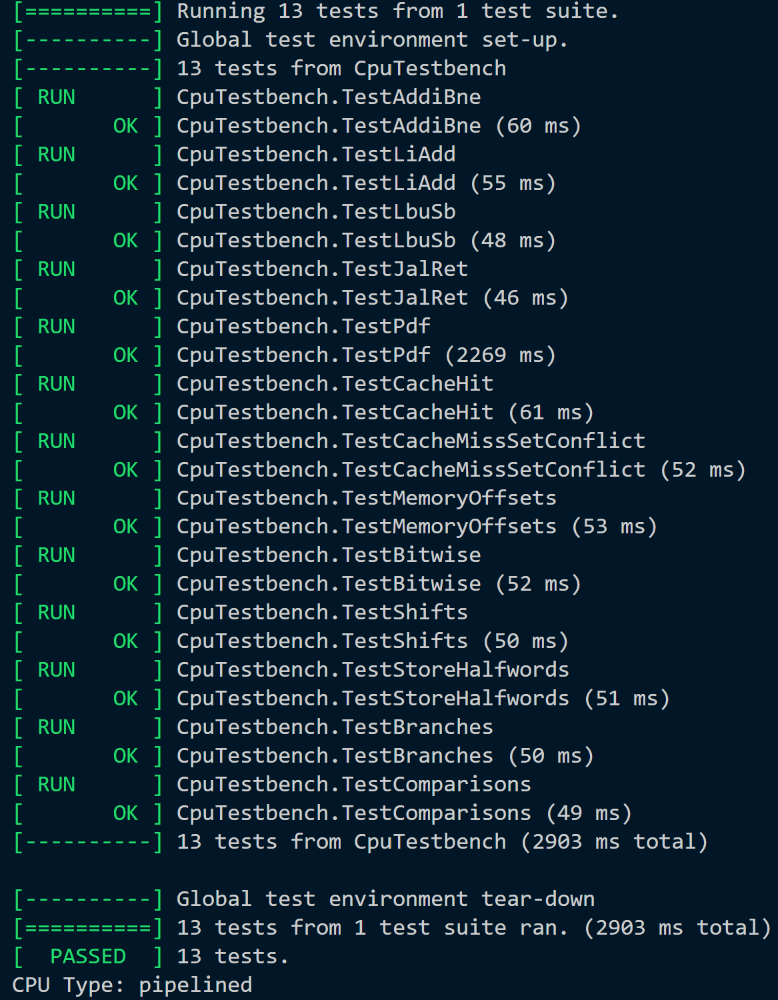

## Team members:

[add names of your teammates]

# Table of Contents

- [Overview](#overview)
    - [Overall Repo Structure](#overall-repo-structure)
- [Key Features & Achievements](#key-features--achievements)
    - [Top Level Contributions](#top-level-contributions)
    - [Team Members and Statements](#team-members-and-statements)
- [Repo Structure](#repo-structure)
    - [Single Cycle RV32I Implementation](#single-cycle-rv32i-implementation)
    - [Stretch Goal 1: Pipelined RV32I Implementation](#stretch-goal-1-pipelined-rv32i-implementation)
    - [Stretch Goal 2: Memory Cached Pipelined RV32I](#stretch-goal-2-memory-cached-pipelined-rv32i)
    - [Stretch Goal 3: Full Instruction Set](#stretch-goal-3-full-instruction-set)
    - [Stretch Goal 4: Branch Target Buffer (BTB)](#stretch-goal-4-branch-target-buffer-btb)
    - [Our Design Decision](#our-design-decision)
- [Verification & Testing](#verification--testing)
    - [Test Suite Overview](#test-suite-overview)
- [Testing Methodology](#testing-methodology)
     - [Automated Testing](#automated-testing)
    - [Visual Verification with VBuddy](#visual-verification-with-vbuddy)
    - [PDF (Probability Density Function)](#pdf-probability-density-function)
    - [Waveform Analysis](#waveform-analysis)  
    - [Viewing Waveforms](#viewing-waveforms) 
- [Design Challenges & Solutions](#design-challenges--solutions)
    - [Cache Integration](#cache-integration)
    - [Pipeline Hazards](#pipeline-hazards)
    - [Testing Strategy](#testing-strategy)

---
# Overview

This repository contains our team’s complete implementation of an RV32I processor, developed progressively across several milestones and maintained across multiple branches for clarity and traceability. The project began with a fully working single-cycle CPU that implemented the core RV32I instruction subset. Building on this foundation, we extended the design into a five-stage pipelined processor that supported complete forwarding and hazard-detection logic, enabling correct resolution of data hazards, load–use dependencies, and control-flow changes due to branches and jumps. The final stage of development introduced a realistic 4 KiB, two-way set-associative write-back data cache, bringing the design closer to modern processor memory hierarchies by supporting tag checks across both ways, dirty and valid tracking, LRU replacement, and multi-cycle miss handling integrated with the pipeline’s stall signals.

## Overall Repo Structure 

We successfully completed the Single-Cycle CPU implementation and all stretch goals: Pipelined processor, Two-Way Set Associative Write-Back Cache, and Full RV32I Design. Our implementations are organized across multiple branches for clarity:

| Branch | Description |
| ------ | ----------- |
| `Single-Cycle-RV32I-Implementation` | Single-cycle CPU with basic instruction subset |
| `Pipelined-RV32I-Implementation` | 5-stage pipelined processor with hazard detection |
| `Memory-Cached-Pipelined-RV32I` | Pipelined CPU with 2-way set-associative cache |
| `Full-Instruction-Set-(Final-CPU)/main` | Complete RV32I with all features integrated |

To access each version:
```bash
git checkout <branch-name>
```
---

# Key Features & Achievements

Our processor implementation includes the following accomplishments:

- **Complete RV32I Base Instruction Set** (excluding ECALL/EBREAK/CSR/FENCE)
  - 40+ instructions including all R-type, I-type, S-type, B-type, U-type, and J-type operations
  - Full support for arithmetic, logic, shift, load/store, branch, and jump instructions

- **5-Stage Pipeline Architecture** (IF → ID → EX → MEM → WB)
  - Comprehensive hazard detection unit
  - Complete data forwarding logic
  - Proper control signal propagation through pipeline stages
  - Pipeline flushing for branch/jump instructions

- **Advanced Memory System**
  - 4 KiB two-way set-associative write-back data cache
  - LRU (Least Recently Used) replacement policy
  - Multi-cycle miss handling with proper stall propagation
  - Dirty bit tracking and write-back on eviction
  - Support for byte, halfword, and word operations

- **Comprehensive Verification**
  - 15 assembly test programs covering all instruction types
  - Cache-specific tests (hits, misses, set conflicts)
  - Visual demonstrations (F1 lights with LFSR random delays, PDF calculations)
  - GTKWave waveform analysis for debugging
  - All tests passing on both single-cycle and pipelined implementations

---

## Top Level Contributions

| Section               | Ambre | Sumukh | Lila | Deniz |
| --------------------- | ----- | ----- | ---- | ----- |
| Repo Setup            |       | `X`   |      |       |
| Single cycle          | `X`   | `X`   | `X`  | `X`   |
| Pipelining            | `X`   | `X`   | `X`  | `X`   |
| Cache                 | `X`   | `X`   | `X`  | `X`   |
| Testing and Verification                 |    |    |   | `X`   |


## Team members and Statements:

| Team Member    | GitHub                                                | CID      | Email           | Link to Personal Statement                        |
|-------------------|-------------------------------------------------------|----------|----------------------------|--------------------------------------------------|
| Deniz Yilmazkaya  | [deniz-arda](https://github.com/deniz-arda)              | 02569298    | day24@ic.ac.uk          | [Personal Statement](personal_statements/DenizYilmazkaya.md) |

---

# Repo Structure

Our repository is organised into multiple branches that each correspond to one major stage of the project: the single-cycle processor, the pipelined implementation of it, then cached pipelined, and finally the full RV32I instruction-complete implementation. We also worked on our individual branches to not disrupt the whole project we were working on. Once one person completed their section and the team was happy with their implementation, we created PRs and merged with main.

For easy testing, we created new branches with the final commit of a specific section in it. For example, in the "Single-Cycle-RV32I-Implementation", we placed the final commit that had the fully implemented single cycle CPU (without the pipelining/cache).

## Single Cycle RV32I Implementation

The branch "Single-Cycle-RV32I-Implementation" contains our initial single-cycle RV32I CPU implementing the basic subset of instructions required

**Instructions Implemented:**
- R-type: `ADD`, `SUB`, `SLL`, `SLT`, `SLTU`, `XOR`, `SRL`, `SRA`, `OR`, `AND`
- I-type (ALU): `ADDI`, `SLTI`, `SLTIU`, `XORI`, `ORI`, `ANDI`, `SLLI`, `SRLI`, `SRAI`
- I-type (Load): `LBU`, `LB`, `LH`, `LW`, `LHU`
- I-type (Jump): `JALR`
- S-type: `SB`, `SH`, `SW`
- B-type: `BEQ`, `BNE`, `BLT`, `BGE`, `BLTU`, `BGEU`
- U-type: `LUI`, `AUIPC`
- J-type: `JAL`

Directory structure:
```
rtl/
├── alu.sv
├── control_unit.sv
├── data_mem.sv
├── datapath.sv
├── extend.sv
├── instr_mem.sv
├── pc_reg.sv
├── register_file.sv
└── top.sv
```

## Stretch goal 1: Pipelined RV32I Implementation

The branch "Pipelined-RV32I-Implementation" introduces our full 5-stage pipeline (IF → ID → EX → MEM → WB), hazard detection, forwarding, and pipeline registers. It still uses the basic instruction subset and a direct memory module without caching.

Directory structure:
```
rtl/
├── pipelined/
│   ├── exe_mem_reg.sv
│   ├── execute.sv
│   ├── forward_unit.sv
│   ├── hazard_unit.sv
│   ├── id_ex_reg.sv
│   ├── if_id_reg.sv
│   ├── mem_wb_reg.sv
│   ├── pc_reg_pipe.sv
│   ├── tb_execute.sv
│   └── top_pipelined.sv
├── shared/
│   ├── alu.sv
│   ├── control_unit.sv
│   ├── data_mem.sv
│   ├── extend.sv
│   ├── instr_mem.sv
│   ├── pc_reg.sv
│   └── register_file.sv
└── single_cycle/
    ├── datapath.sv
    └── top.sv
```

**Key Additions:**
- Pipeline registers for each stage (IF/ID, ID/EX, EX/MEM, MEM/WB)
- Hazard detection unit for load-use hazards
- Forwarding unit for data hazards (EX-to-EX, MEM-to-EX forwarding)
- Pipeline flushing mechanism for control hazards
- Proper multicycle control signal propagation

## Stretch goal 2: Memory Cached Pipelined RV32I

For this branch "Memory-Cached-Pipelined-RV32I", we kept the 5-stage pipeline from the previous milestone and added a real cache subsystem to replace the simple data memory.

Directory structure:
```
rtl/
├── pipelined/
│   ├── exe_mem_reg.sv
│   ├── execute.sv
│   ├── forward_unit.sv
│   ├── hazard_unit.sv
│   ├── id_ex_reg.sv
│   ├── if_id_reg.sv
│   ├── mem_wb_reg.sv
│   ├── pc_reg_pipe.sv
│   ├── tb_execute.sv
│   └── top_pipelined.sv
├── shared/
│   ├── alu.sv
│   ├── control_unit.sv
│   ├── data_cache.sv
│   ├── data_mem.sv
│   ├── extend.sv
│   ├── instr_mem.sv
│   ├── pc_reg.sv
│   └── register_file.sv
└── single_cycle/
    ├── datapath.sv
    └── top.sv
```

**Major Additions:**
- 4 KiB 2-way set-associative write-back cache (128 sets, 16-byte lines)
- Tag, valid, and dirty bit arrays for both ways
- LRU bit per set for replacement policy
- Multi-cycle miss handling with automatic stall propagation
- Cache-aware hazard unit modifications
- Shadow registers for handling misses during pipeline operation

**Cache Specifications:**
- Total size: 4 KiB
- Associativity: 2-way set-associative
- Line size: 16 bytes (4 words)
- Number of sets: 128
- Tag bits: 21 bits
- Index bits: 7 bits
- Offset bits: 4 bits

This branch integrates a realistic memory subsystem that significantly increases realism and complexity. Adding a cache required additional stall pathways, dirty-bit handling, proper line fill behaviour, and full tag/index/offset decomposition. This significantly increased realism and complexity compared to the earlier pipeline.

## Stretch goal 3: Full Instruction Set

Finally in the brache "Full-Instruction-Set-(Final-CPU)/main" is our final, fully functional processor supporting the entire RV32I base ISA (except ECALL/EBREAK/CSR/FENCE). All pipeline, hazard, forwarding, and cache features are integrated and passing all reference tests.

Directory structure:
```
rtl/
├── pipelined/
│   ├── exe_mem_reg.sv
│   ├── execute.sv
│   ├── forward_unit.sv
│   ├── hazard_unit.sv
│   ├── id_ex_reg.sv
│   ├── if_id_reg.sv
│   ├── mem_wb_reg.sv
│   ├── pc_reg_pipe.sv
│   ├── tb_execute.sv
│   └── top_pipelined.sv
├── shared/
│   ├── alu.sv
│   ├── control_unit.sv
│   ├── data_cache.sv
│   ├── data_mem.sv
│   ├── extend.sv
│   ├── instr_mem.sv
│   ├── pc_reg.sv
│   └── register_file.sv
└── single_cycle/
    ├── datapath.sv
    └── top.sv
```

This is our final and most complete design. Here we extended the instruction set to include all RV32I ALU, load/store, branch, and shift operations, and we fixed all pipeline/control/cache interactions until every test case passed. This branch represents the culmination of all architectural, verification, and debugging work.

## Stretch goal 4: Branch Target Buffer (BTB)

As a performance enhancement beyond the baseline requirements, we integrated a **Branch Target Buffer (BTB)** for dynamic branch prediction. This addition significantly reduces control hazard penalties by allowing the pipeline to speculatively fetch from predicted branch targets.

**BTB Design:** The BTB is implemented as a 64-entry direct-mapped structure (`btb.sv`) that stores predicted branch targets. Each entry contains a valid bit, a 1-bit prediction (taken/not taken), a tag field (PC[31:8]), and the predicted target address. The BTB is indexed using PC bits [7:2], providing efficient lookup in a single cycle.

**Pipeline Integration:** During instruction fetch (IF stage), the current PC is used to perform a BTB lookup. If a hit occurs, the predicted target address is immediately used as the next PC, allowing the pipeline to fetch from the predicted address without waiting for branch resolution in the execute stage. The BTB prediction signals are passed through the IF/ID and ID/EX pipeline registers to reach the EX stage for comparison with actual branch outcomes.

**Misprediction Handling:** The hazard unit was modified to only flush the pipeline on mispredictions, not on all taken branches. A misprediction is detected when: (1) the branch was predicted taken but not taken, (2) the branch was predicted not taken but taken, or (3) the predicted target doesn't match the actual target. Correctly predicted branches incur zero penalty cycles (versus the previous 2-cycle penalty), while mispredictions still incur a 2-cycle flush penalty.

**Dynamic Learning:** The BTB updates dynamically when branches resolve in the EX stage. Taken branches store their target address and set the prediction to taken for future executions. Not-taken branches update their prediction state to not taken. This adaptive mechanism allows the BTB to learn branch behavior patterns and improve prediction accuracy over time.

**Performance Impact:** This enhancement provides significant performance improvements on branch-heavy workloads by reducing control hazard penalties. For typical workloads with good branch locality, this can provide 10-30% performance improvement by eliminating pipeline stalls on correctly predicted branches.

## Our design decision:


The diagram above shows our complete processor architecture with all components integrated, including the pipelined datapath, hazard detection and forwarding units, and the two-way set-associative cache.

---

# Verification & Testing

Our processor underwent extensive verification through multiple testing approaches to ensure correctness across all implementations.

## Test Suite Overview

We developed and utilized 15 comprehensive assembly test programs:

| Test # | Name | Instructions Tested | Purpose |
|--------|------|---------------------|---------|
| 1 | `addi_bne` | ADDI, BNE | Basic arithmetic and branching |
| 2 | `li_add` | LUI, ADD | Large immediate loading and addition |
| 3 | `lbu_sb` | LBU, SB | Byte-level memory operations |
| 4 | `jal_ret` | JAL, JALR | Function calls and returns |
| 5 | `pdf` | All memory + arithmetic | Full program (512 bytes, histogram) |
| 8 | `cache_hit` | LW, SW, ADDI | Cache hit performance waveforms |
| 9 | `cache_miss_set_conflict` | LW across sets | Cache replacement (LRU) waveforms |
| 10 | `memory_offsets` | LW, SW with offsets | Address calculation |
| 11 | `bitwise` | XOR, OR, AND | Logical operations |
| 12 | `shifts` | SLL, SRL, SRA | Shift operations |
| 13 | `store_halfwords` | SH, LH, LHU | 16-bit memory access |
| 14 | `branches` | BEQ, BNE, BLT, BGE, BLTU, BGEU | All branch types |
| 15 | `comparisons` | SLT, SLTU, SLTI, SLTIU | Comparison instructions |

# Testing Methodology

## Automated Testing
This can be ran on the main `Full-Instruction-Set-(Final-CPU)/main` branch for both single-cycle and pipelined processor implementations that are tested under the full RISCV-32I instruction set.
Our automated test framework uses Verilator for simulation:
- Compiles SystemVerilog RTL to C++ model
- Runs each test program for specified cycles (typically 10,000)
- Validates output register `a0` against expected values
- Generates waveforms (`.vcd`) for debugging
- Produces disassembly (`.dis`) for verification

All tests are executed via shell scripts:
```bash
cd tb

./doit2.sh    # defaults to single-cycle implementation

./doit2.sh pipelined    # for pipelined
```
### Automated Test Outputs
| Single Cycle | Pipelined |
|:------------:|:---------:|
|  |  |

---
## Visual Verification with VBuddy:
## F1 Lights
F1 lights are also implemented to run on this branch, it uses an automatic trigger therefore it will start executing the program without having to click the Vbuddy button. It uses an LFSR implemented on the code, which can be found under `/tb/asm/6_f1_lights.s`. To run the F1 lights implementation:
``` bash
cd tb

run_f1.sh    # runs on single-cycle by default

run_f1.sh pipelined    # runs on pipelined if specified
```
#### What it does: 
- Automatically gets triggered to run F1 starting lights sequence
- Shows hex output on the screen which was initially used for debugging
- Implements F1 starting sequence with 8 LEDs
- Pattern: 2^n + 1 (1 → 3 → 7 → 15 → 31 → 63 → 127 → 255)
- Enhanced version includes LFSR-based random delays using XOR feedback
- Demonstrates branches, subroutines, and sequential logic
The video of it working can be found under folder `/tb/test_images`. The file is named `F1_lights_final.mp4`. [Watch F1 Lights Demo](tb/test_images/F1_lights_final.mp4)
---
## PDF (Probability Density Function): 
- Plots three distributions: Gaussian, Noisy, Triangle
- Processes data from memory (256 values)
- Displays results on VBuddy screen
- Tests load operations, memory access, and arithmetic
### Running Reference Program
The visual verification of PDF was completed on the `Single-Cycle-RV32I-Implementation` branch. The reference program Vbuddy implementation is run by switching to that branch and using the `run_pdf.sh` script:

``` bash
cd tb

./run_pdf.sh    # Runs Gaussian distribution by default

# For other distributions, specify the path
./run_pdf.sh reference/triangle.mem
./run_pdf.sh reference/noisy.mem
```
Images of the different distributions:
#### Gaussian Distribution


#### Noisy Distribution


#### Triangle Distribution


[For videos of the pdf testing click here](tb/test_images)

## Waveform Analysis
Used GTKWave extensively for:
- Cache state machine verification
- Pipeline stall signal propagation
- Forwarding path validation
- Branch flush behavior
- Multi-cycle operations timing


### Known Debug Solutions

During development, we encountered and resolved several critical issues:

1. **Instruction Memory Fetch Issue** - Instructions weren't being fetched properly initially. Fixed by correcting timing in instruction memory module.

2. **Pipeline Register Timing** - Pipeline registers were initially on positive edge, causing read-before-write issues. Changed to negative edge for proper operation.

3. **F1 Lights Blinking** - First LED was blinking unexpectedly. Root cause: pattern calculation done in two operations without temporary register. Fixed by using temp register for atomic updates.

4. **Cache FSM Timing** - Cache state machine timing didn't match memory timing. Resolved through careful state machine redesign and proper clock edge management.

5. **Pipeline Stall Propagation** - Cache misses weren't properly stalling the pipeline. Fixed by adding stall signal to all pipeline registers and implementing shadow registers.

---

## Viewing Waveforms
After running tests, waveforms are saved in `tb/test_out/<test_name>/`:
```bash
gtkwave tb/test_out/1_addi_bne/waveform_single.vcd
```

---

# Design Challenges & Solutions

## Cache Integration
Integrating the 2-way set-associative cache required careful coordination with the pipeline. Key challenges included:
- **Stall Signal Propagation**: Ensuring cache misses properly stalled all pipeline stages without losing instructions
- **Shadow Registers**: Implementing shadow registers to maintain pipeline state during multi-cycle cache operations
- **Write-back Handling**: Managing dirty bit tracking and write-back on eviction

## Pipeline Hazards
The pipelined implementation required sophisticated hazard handling:
- **Data Hazards**: Implemented forwarding paths from MEM and WB stages to EX stage
- **Load-Use Hazards**: Added stall logic in hazard unit for load-followed-by-use scenarios
- **Control Hazards**: Implemented pipeline flushing for branches and jumps

## Testing Strategy
To ensure comprehensive verification:
- Created modular test scripts that work for both single-cycle and pipelined versions
- Developed cache-specific tests targeting hits, misses, and conflicts
- Standardized test output structure in `tb/test_out/` for consistent file organization
- Used LFSR-based random delays in F1 test to verify complex instruction sequences

---

## Resources

- [RISC-V Specification](https://riscv.org/technical/specifications/)
- [RISC-V Instruction Set Reference Card](https://cs.sfu.ca/~ashriram/Courses/CS295/assets/notebooks/RISCV/RISCV_CARD.pdf)
- Course materials: EIE2 Instruction Set Architecture & Compiler (IAC)