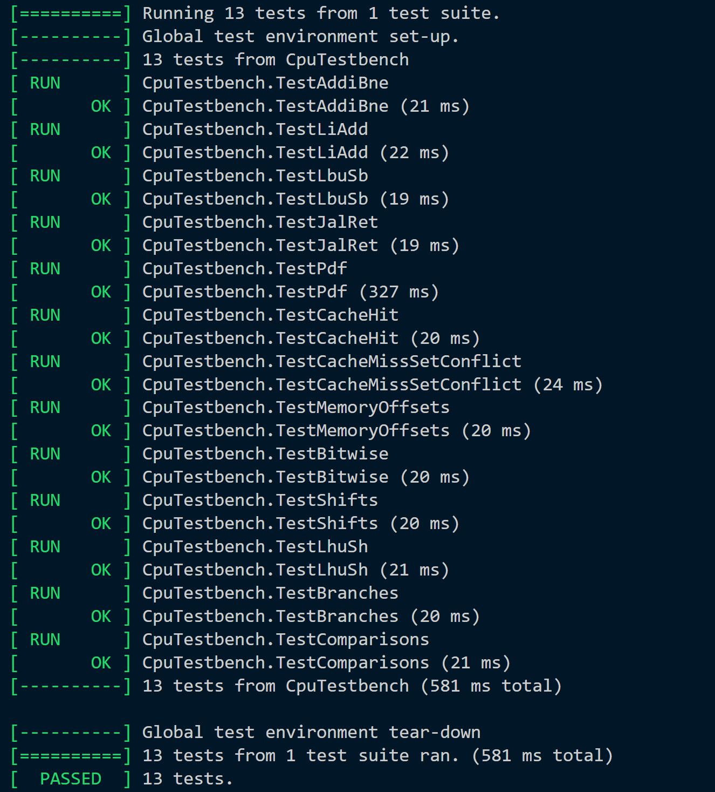
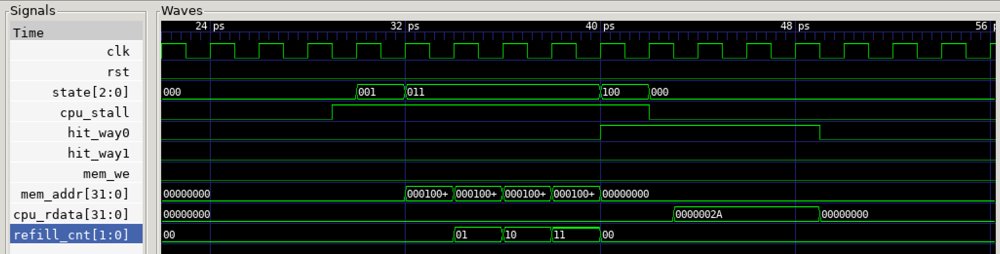

# Personal Statement - Deniz Yilmazkaya

## Contents
- [Overview](#overview)
- [Key Technical Contributions](#key-technical-contributions)
	- [1. Single Cycle CPU Testing and Top-Level Design](#1-single-cycle-cpu-testing-and-top-level-design)
	- [2. Verification](#2-verification)
   		- [2.1 F1 Starting Lights Implementation and Testing](#21-f1-starting-lights-implementation-and-testing)
    	- [2.2 Reference Program](#22-reference-program)
	  	- [2.3 Full RV32I Design Testing](#23-full-rv32i-design-testing)
	- [3. Pipelining Integration and Testing](#3-pipelining-integration-and-testing)
	- [4. Cache Memory Integration and Testing](#4-cache-memory-integration-and-testing)
- [Key Design Decisions](#key-design-decisions)
- [Reflection](#reflection)
---
## Overview
Working as the verification and integration engineer for the team, my role was to unify the individual building blocks of the RISC-V CPU and conduct tests checking the integrity of the processor, and debugging the lower level modules when necessary. 

Beyond automated testing, I utilized GTKWave for waveform analysis and Vbuddy for visual verification of the processor. This was particularly valuable for the F1-Lights and PDF implementations, where I developed custom C++ testbenches and shell scripts to streamline the testing process. Furthermore, GTKWave allowed me to take a close look into the processor's structure whilst implementing cache memory and pipelining.

This role proved highly engaging as it required maintaining comprehensive knowledge of all modules during testing and debugging phases. The collaborative nature of resolving complex issues with teammates and seeing a final working processor was particularly rewarding.

---  
# Key Technical Contributions:  

## 1. Single Cycle CPU Testing and Top Level Design

For the single cycle implementation, I initially created the `top.sv` module that connected all the lower level components [Commit: 1ce8c95](https://github.com/sadir06/Project_Brief/commit/1ce8c951ccddb54a9bfdd2c053abec06601227fb). The first implementation supported the reduced RISC-V instruction set with PC logic handling, PC+4 increments, and BNE instructions. Later, for the full RISC-V32I implementation, I expanded the ALUControl signal from 3 to 4 bits to accommodate additional instructions and add further logic for the other branch instructions (BEQ, BLT, BGE, BLTU, BGEU) which involved adapting the `control_unit.sv` and `top.sv`. ([Commit: 889aa36](https://github.com/sadir06/Project_Brief/commit/889aa366dfc9594b07a153b154f226b85e57cab0)) 

### Initial Debugging
On the initial implementation of the single-cycle processor, due to lack of communication, the `a0` register was not properly connected to the output for some of the lower level modules, requiring corrections and I added reset logic to the register file to ensure proper initialization during resets. ([Commit: 3602129](https://github.com/sadir06/Project_Brief/commit/36021297d459ee9b808e1f3efc3b3c9359aac3f2) & [Commit f5d59f5](https://github.com/sadir06/Project_Brief/commit/f5d59f505d0009d8dbf582fbbb67a65718ab3313)). 

Additionally, a more significant issue emerged in the instruction memory module: It was storing 32-bit words directly, even though RISC-V uses byte addressing. This caused instructions to not actually be fetched during testing, making the output of every test equal to 0. This was fixed in collaboration with my teammate, Lila, by first changing the memory array to store individual 8-bit bytes instead of 32-bit words, adding base address offset calculation, and adding logic for the assembly of 32-bit instructions from 4 consecutive bytes in little-endian order [Commit: 21f8a12](https://github.com/sadir06/Project_Brief/commit/21f8a127ad04035d4e50985b3c6fb5fd8e44380b) :

``` systemverilog
instr_o = {rom_array[offset_addr+3], rom_array[offset_addr+2],
              rom_array[offset_addr+1], rom_array[offset_addr+0]};
```
This debugging experience highlighted the importance of thoroughly understanding specification requirements and the value of collaborative problem-solving.

---
## 2. Verification
### 2.1 F1 Starting Lights Implementation and Testing

The F1 lights testbench was initially adapted from Lab-3 [Commit: 611f91f](https://github.com/sadir06/Project_Brief/commit/611f91fc5b8b67a71ff008436f2c74945267e93b), however, my teammate Lila and I ran into a problem whilst testing; the lights were turning on as they were supposed to, however, the first LED was blinking instead of staying on. To diagnose this issue, I implemented debug monitoring for the value of `a0` on the Vbuddy display:
``` cpp
        // Display F1 light pattern
        vbdBar(top->a0 & 0xFF);
        
        // Also display on hex for debugging
        vbdHex(4, (top->a0 >> 4) & 0xF);
        vbdHex(3, top->a0 & 0xF);
```
This enabled us to notice that the assembly code was not incrementing with the pattern 2^n + 1 atomically: the two-operation sequence created a visible intermediate state, causing the blink. Therefore, we added a temporary register that would be used to update the value of `a0`. [Commit: febede2](https://github.com/sadir06/Project_Brief/commit/febede2ba63da950e1913ecde23c1a7566186504):
``` asm
increment_light:
    ADD  t3, a0, a0         # t3 = a0 * 2 (use temp register)
    ADDI t3, t3, 1          # t3 = t3 + 1
    ADD  a0, t3, zero       # a0 = t3 (instant update)
    JALR zero, ra, 0        # Return
```

Afterwards, when the remaining RISC-V32I instructions were added, I enhanced the assembly code with a random delay feature using LFSR which we had learned in Lab-3: 
``` asm
# Subroutine: Update 4-bit LFSR
# Implements primitive polynomial x^4 + x^3 + 1
# LFSR state stored in s1
lfsr_update:
    # Get bit 3
    SRLI t3, s1, 3          # Shift right by 3 positions
    ANDI t3, t3, 0x01       # Mask to get only bit 3
    
    # Get bit 2
    SRLI t4, s1, 2          # Shift right by 2 positions
    ANDI t4, t4, 0x01       # Mask to get only bit 2
    
    # XOR the two taps to get feedback bit
    XOR  t3, t3, t4         # t3 = bit[3] XOR bit[2]
    
    # Shift LFSR left by 1 position
    SLLI s1, s1, 1          # Shift left
    
    # Insert feedback bit at LSB
    OR   s1, s1, t3         # Insert feedback bit
```
(See [Commit: 3fc193c](https://github.com/sadir06/Project_Brief/commit/3fc193cb3aa05a3f6e8bc314ce0f8c9dcedd1ab4) for further details on the random delay implementation.)
Additionally, once the pipelined processor was implemented, I adapted the `run_f1.sh` script to support running the F1 lights program on both the pipelined and the single-cycle implementations of the processor. [Commit: 396d493](https://github.com/sadir06/Project_Brief/commit/396d4935019aeb21be1820b76c00b3fd642e1e73)

Example:
``` bash
./run_f1.sh # for single-cycle
./run_f1.sh pipelined # for pipelined 
```

### 2.2 Reference Program
Whilst writing the shell script to run PDF, I structured it similar to `doit.sh` for a clean repository structure, since it was programmed to place the test outputs such as the waveform file under the `test_out` folder.

Additionally, rather than manually editing the testbench file for different distributions, I enhanced the shell script to accept the distribution name as an argument. ([Commit: 1ab5358](https://github.com/sadir06/Project_Brief/commit/1ab5358a142396d42bc31577121189841be33ab2)) For example, to run **noisy.mem** you would do
``` bash
./run_pdf.sh reference/noisy.mem
```
Other decisions I made were to plot on every third cycle and add an optional delay for the plotting on the testbench since otherwise the visuals were not fitting on the screen and it was also being displayed too quickly on the Vbuddy screen, making it difficult to observe the behavior of the PDF and confirm that it was working. 
```cpp
			// plot every 3rd cycle
			if (plot_counter % 3 == 0) {
                vbdPlot(top->a0 & 0xFF, 0, 255);
                usleep(DELAY_US);  // Add delay to slow down visualization
            }
```
Pictures of the plots:


### 2.3 Full RV32I Design Testing
In order to test the full RISC-V32I implementation, I developed six additional assembly test programs targeting specific instruction categories and edge cases. These tests specifically addressed branches, shifts, memory operations, and other arithmetic operations that were not covered by the original test suite. These can be viewed under the `tb/asm` folder. (See [Commit: ee95a97](https://github.com/sadir06/Project_Brief/commit/ee95a973e2573efa79e930c9a202fdee33fa991e) for the assembly test files.)
#### Overview of New Tests:
| Test # | Name | Instructions Tested | Purpose |
|--------|------|---------------------|---------|
| 10 | `memory_offsets` | LW, SW with offsets | Address calculation |
| 11 | `bitwise` | XOR, OR, AND | Logical operations |
| 12 | `shifts` | SLL, SRL, SRA | Shift operations |
| 13 | `store_halfwords` | SH, LH, LHU | 16-bit memory access |
| 14 | `branches` | BEQ, BNE, BLT, BGE, BLTU, BGEU | All branch types |
| 15 | `comparisons` | SLT, SLTU, SLTI, SLTIU | Comparison instructions |

After adding these tests, I modified `verify.cpp` so that they were included in the automatic testing. 

<p align="center">
  
</p>

---
## 3. Pipelining Integration and Testing

In order to test the pipelined implementation, I created a new script `doit2.sh`, almost identical to the original `doit.sh`; the main difference being that you can choose between running automated tests on the single-cycle and the pipelined CPU, i.e. 
```bash
./doit2.sh # for single-cycle
./doit2.sh pipelined # for pipelined
```
[See Commit: 1c24a65 for shell script](https://github.com/sadir06/Project_Brief/commit/1c24a654abfc365fe66bb390d28695c786fdeade)

This infrastructure proved crucial for isolating bugs. When a test passed in single-cycle but failed in pipelined mode, I could immediately determine whether the issue resided in shared modules `rtl/shared` or in pipeline-specific logic making debugging more efficient.

### Debugging
The initial pipelined implementation proved to require debugging; one of the main issues being that pipeline registers were updating on the positive clock edge, which created race conditions.The solution required changing to negative edge triggering, allowing data to be written on the first half-cycle and read on the second. [Commit: 7e0534b](https://github.com/sadir06/Project_Brief/commit/7e0534b590ad9026e0a73e4fcd28c2b5b563ee03) 

Furthermore, there were bug fixes regarding the forwarding logic on the pipeline ensuring that the correct data was being selected to forward from MEM stage i.e. choosing between ALU result, memory data, and PC+4 (for `JAL`/`JALR`) instructions. 

On top of that, a significant bug was the hardcoded `funct3` signal which was set to 3'b100. I resolved this by properly pipelining the `funct3` signal through `ID`/`EX`/`MEM` stages. [Commit: 8a75343](https://github.com/sadir06/Project_Brief/commit/8a7534352018402ccc33d097d97015a6550d8a8c) & [Commit: b915965](https://github.com/sadir06/Project_Brief/commit/b9159659bece0946fb1384dae7c0266127a0bd2c)

## 4. Cache Memory Integration and Testing

To effectively test the cache memory, I developed two cache-specific assembly tests: 8_cache_hit.s verified that repeated loads from the same address result in cache hits, while 9_cache_miss_set_conflict.s tested the 2-way set-associative behavior with conflicting memory addresses. [Commit: 31bbd05](https://github.com/sadir06/Project_Brief/commit/31bbd059077b0b08a4236d366e1c0c1eaa80f101)

### Debugging
Initially, there was a clock synchronization problem - the cache memory FSM operated on `negedge clk` whilst the underlying `data_mem.sv` module updated on `posedge`, which created a half-cycle timing offset causing race conditions and data corruption during 4-word cache refills. To solve this I converted the cache controller to update on `posedge clk`. 

Another issue was that during a cache miss, the cache would refill the line from memory but lose the original write request. The write signals of the CPU. `cpu_wdata`, `cpu_we`, and `funct3` were only valid during the `C_IDLE` state of the cache FSM. By the time the FSM reached `C_RESPOND`, these signals had changed or become invalid. The way Lila and I solved this was by implementing a further shadow register system to store write miss information [Commit: 37f8839](https://github.com/sadir06/Project_Brief/commit/37f88396edab71bf43c8a4862309184e2c8237da) :
```systemverilog
logic shadow_we;              // Store whether miss was a write
logic [31:0] shadow_wdata;    // Capture write data
logic [2:0] shadow_funct3;    // Capture operation type (SB/SH/SW)
logic [OFFSET_BITS-1:0] shadow_offset;      // Byte offset within line
logic [1:0] shadow_word_offset;             // Word offset within line
```
For instance, when a cache miss is detected in the `C_IDLE` state: 
```systemverilog
shadow_addr   <= cpu_addr;
  shadow_we     <= cpu_we;      
  shadow_wdata  <= cpu_wdata; 
  shadow_funct3 <= cpu_funct3;  
```
During the `C_RESPOND` state, ensured there was proper refill logic:
``` systemverilog
  C_RESPOND: begin
      if (shadow_we) begin
          // Reconstruct byte-masked write using shadow registers
          data_array[victim_way][shadow_index][shadow_word_offset] <= resp_write_data;
          dirty_array[victim_way][shadow_index] <= 1'b1;
      end
  end
```
This approach added five shadow registers but prevented data loss in write-miss scenarios. The trade-off of slightly increased hardware complexity was justified by the cache memory now working correctly.

Finally, after adding stall logic to the pipeline registers in case of a cache miss ([Commit: fe36dcf](https://github.com/sadir06/Project_Brief/commit/fe36dcfe90e27f8a031bbba9233d6668915a2845)), the cache memory began to work. 

Example from `8_cache_hit.s` test: 


*Initially CPU stalls during cache miss as expected, and begins the refill process. Cache hit_way0 goes high whilst hit_way1 stays low showing correct behavior for the data access. After the process cpu_rdata[31:0] has the correct value of 0x0000002A.*

---
### Key Design Decisions
- Modifying the shell scripts so that they support both the pipelined and the single-cycle CPU made it seamless to switch between the implementations, making it substantially easier to find bugs. 
- Started with a simple F1 lights assembly script without random delay. After more instructions got implemented, modified the original to have random delay through LFSR logic. 
- Standardized all the test scripts (`run_f1.sh`, `doit2.sh` etc.) to be structured the same way as the original `doit.sh` script for consistent file handling under the `tb/test_out` folder, making the repository cleaner. 

### Reflection
Throughout the project, our team was very efficient at systematically building the lower level modules for each implementation. However, debugging the processor proved to be a task that required a great amount of patience and perseverance, and something that I should not have done by myself at times. I noticed that when I worked in collaboration with my teammates, having multiple perspectives on a situation helped debug the system quicker. 

A painful example of this was when the tests were running on my teammate, Lila's laptop, but not on mine. Proper communication allowed me to realize that this issue was due to my compiler being outdated, and not the code being incorrect. Without knowing this I would have spent further hours trying to debug the code.

While I created comprehensive assembly tests covering edge cases, time constraints prevented implementation of a randomized instruction generator. Such a tool would have provided exhaustive testing by generating thousands of random valid RISC-V instruction sequences. However, the manual test suite's targeted approach to edge cases (equal operands in branches, boundary conditions in shifts) provided high confidence in correctness for the implemented subset.

Given additional time, I would implement the random test generator in Python. 
An idea of the implementation:
```python
def generate_random_instruction():
    opcode = random.choice(['R-type', 'I-type', 'S-type', 'B-type'])
    
    if opcode == 'R-type':
        return {
            'op': random.choice(['ADD', 'SUB', 'XOR', 'OR', 'AND']),
            'rd': random.randint(0, 31),
            'rs1': random.randint(0, 31),
            'rs2': random.randint(0, 31)
        }
    # Similar patterns for other types...
	# Limit immediate values for I-type instructions
	# Think about preventing infinite loops
```
The obvious benefit of doing this is that it would expose edge cases that could have been missed by the current tests. 

Overall, this project gave me valuable experience in hardware design and verification in a team environment preparing me for professional engineering work. The systematic approach to testing and debugging not only ensured processor correctness but also created reusable frameworks that accelerated testing and design throughout the project. Even though at times debugging proved to be difficult, it was truly rewarding to see a final working product that has passed all the testing measures.  
